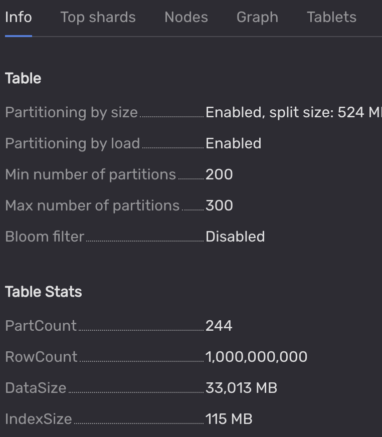
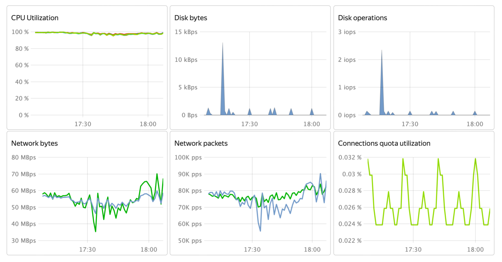
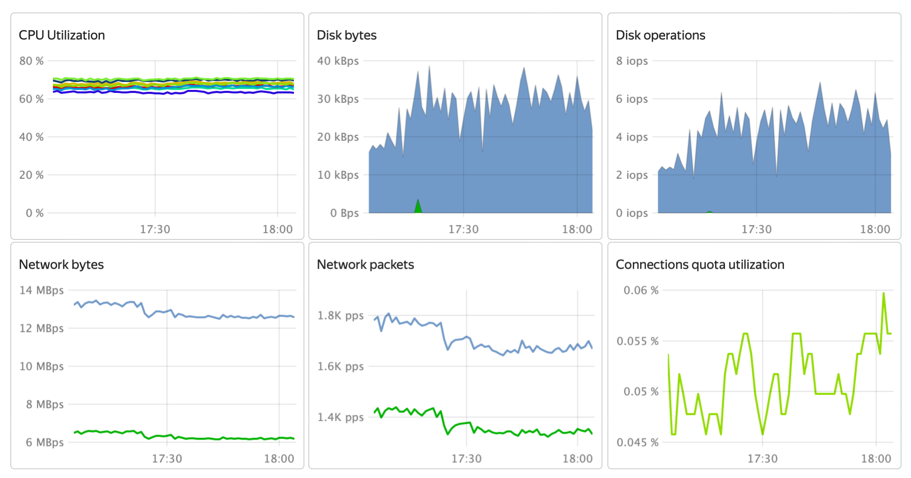
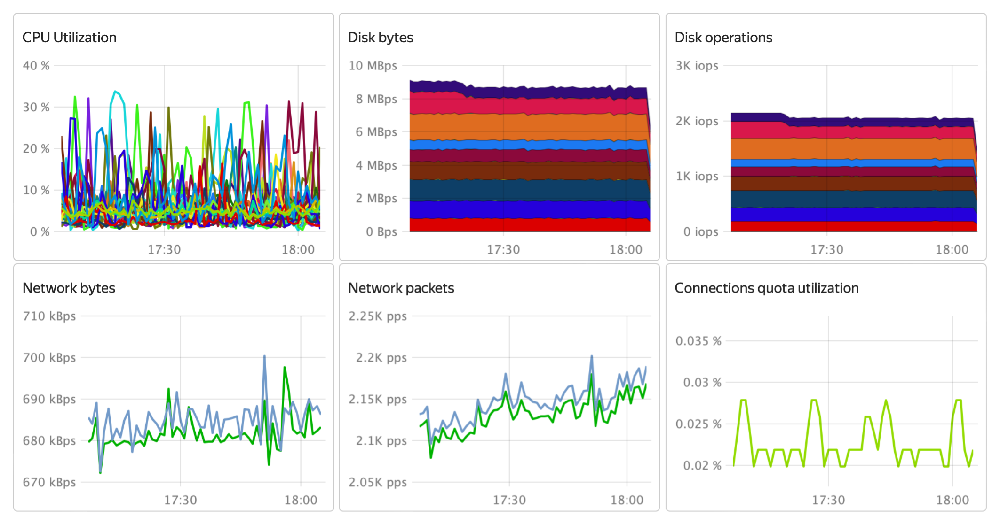

# 1. Результаты на 2023-09-29

## 1.1. Вычислительные ресурсы

Использовались виртуальные машины в Yandex Cloud в следующей конфигурации:

* 1 x узел хранения, избыточность выключена
    * 32 x vCPU (требуется для подключения 10-ти дисков, утилизация менее 40%)
    * 32 Гбайт оперативной памяти
    * 1 x 50 Гбайт загрузочный диск network-ssd
    * 9 x 186 Гбайт диски для данных network-ssd-nonreplicated
    * включена опция "Программно ускоренная сеть"
* 9 x вычислительные узлы
    * 16 x vCPU (обязательно одна NUMA-нода)
    * 32 Гбайт оперативной памяти
    * 1 x 50 Гбайт загрузочный диск network-ssd
    * включена опция "Программно ускоренная сеть"
* 3 x узлы для подачи нагрузки
    * 8 x vCPU
    * 16 Гбайт оперативной памяти
    * 1 x 50 Гбайт загрузочный диск network-ssd
    * включена опция "Программно ускоренная сеть"

## 1.2. Программная конфигурация

Операционная система: ubuntu-22-04-lts-v20230925

На узел хранения и вычислительные узлы установлена YDB в сборке ясубд.рф версии 23.2.12.3, [ссылка на дистрибутив](https://ясубд.рф/binaries/release/23.2.12.3/yasubd-23.2.12.3-linux-amd64.tar.gz).

Использовалась конфигурация без аутентификации и TLS (важно: блокировать доступ из внешних сетей к незащищённой инсталляции).

Настроечные файлы кластера YDB: [статического узла](./yc-config/ydbconf/storage.yaml), [динамических узлов](./yc-config/ydbconf/dynamic.yaml).

На узлы для подачи нагрузки установлены пакеты: `screen` и `openjdk-17-jdk`, а также Apache JMeter версии 5.6.2, [ссылка на дистрибутив](https://dlcdn.apache.org//jmeter/binaries/apache-jmeter-5.6.2.tgz).

Скомпилированная программа apirx_test была установлена на узлы подачи нагрузки, и доступна в [разделе релизов репозитория](https://github.com/zinal/apirx-demo/releases/tag/v2023-09-29).

На момент запуска теста в таблице `hashes` находилось `1 000 000 000` (один миллиард) записей.

## 1.3. Запуск теста

Запуск теста производится сразу с трёх узлов для подачи нагрузки. На каждом узле была запущена своя копия программы apirx_test, и своя копия сценария JMeter.

До начала фиксации измерений было выполнено ожидание стабилизации шардирования таблицы `hashes` по признаку прекращения изменения количества шардов таблицы. Итоговое состояние зафиксировано на скриншоте ниже.



## 1.4. Результаты после стабилизации

Примеры одновременно собранных 5 семплов каждой из 3 копий запущенного сценария приведены ниже:

Сценарий 1:

```text
summary +  15302 in 00:00:30 =  510.1/s Avg:    61 Min:    14 Max:   274 Err:     0 (0.00%) Active: 100 Started: 100 Finished: 0
summary = 2740765 in 01:29:59 =  507.6/s Avg:    87 Min:     9 Max:  2148 Err:     0 (0.00%)
summary +  15169 in 00:00:30 =  505.6/s Avg:    86 Min:    13 Max:   381 Err:     0 (0.00%) Active: 100 Started: 100 Finished: 0
summary = 2755934 in 01:30:29 =  507.6/s Avg:    87 Min:     9 Max:  2148 Err:     0 (0.00%)
summary +  15189 in 00:00:30 =  506.3/s Avg:    69 Min:    12 Max:   369 Err:     0 (0.00%) Active: 100 Started: 100 Finished: 0
summary = 2771123 in 01:30:59 =  507.6/s Avg:    86 Min:     9 Max:  2148 Err:     0 (0.00%)
summary +  15218 in 00:00:30 =  507.2/s Avg:    74 Min:    13 Max:   360 Err:     0 (0.00%) Active: 100 Started: 100 Finished: 0
summary = 2786341 in 01:31:29 =  507.6/s Avg:    86 Min:     9 Max:  2148 Err:     0 (0.00%)
summary +  15278 in 00:00:30 =  509.3/s Avg:    59 Min:    14 Max:   258 Err:     0 (0.00%) Active: 100 Started: 100 Finished: 0
summary = 2801619 in 01:31:59 =  507.6/s Avg:    86 Min:     9 Max:  2148 Err:     0 (0.00%)
```

Сценарий 2:

```text
summary +  13761 in 00:00:30 =  458.7/s Avg:    90 Min:    15 Max:   386 Err:     0 (0.00%) Active: 100 Started: 100 Finished: 0
summary = 2548083 in 01:30:07 =  471.3/s Avg:    90 Min:    11 Max:  1920 Err:     0 (0.00%)
summary +  13773 in 00:00:30 =  459.1/s Avg:    76 Min:    15 Max:   408 Err:     0 (0.00%) Active: 100 Started: 100 Finished: 0
summary = 2561856 in 01:30:37 =  471.2/s Avg:    89 Min:    11 Max:  1920 Err:     0 (0.00%)
summary +  13797 in 00:00:30 =  459.8/s Avg:    83 Min:    15 Max:   409 Err:     0 (0.00%) Active: 100 Started: 100 Finished: 0
summary = 2575653 in 01:31:07 =  471.2/s Avg:    89 Min:    11 Max:  1920 Err:     0 (0.00%)
summary +  13824 in 00:00:30 =  460.9/s Avg:    71 Min:    14 Max:   239 Err:     0 (0.00%) Active: 100 Started: 100 Finished: 0
summary = 2589477 in 01:31:37 =  471.1/s Avg:    89 Min:    11 Max:  1920 Err:     0 (0.00%)
summary +  13701 in 00:00:30 =  456.7/s Avg:    78 Min:    13 Max:   516 Err:     0 (0.00%) Active: 100 Started: 100 Finished: 0
summary = 2603178 in 01:32:07 =  471.0/s Avg:    89 Min:    11 Max:  1920 Err:     0 (0.00%)
```

Сценарий 3:

```text
summary +  15566 in 00:00:30 =  518.8/s Avg:    74 Min:    13 Max:   337 Err:     0 (0.00%) Active: 100 Started: 100 Finished: 0
summary = 2922887 in 01:27:34 =  556.3/s Avg:    89 Min:     9 Max:  1566 Err:     0 (0.00%)
summary +  15432 in 00:00:30 =  514.4/s Avg:    78 Min:    12 Max:   385 Err:     0 (0.00%) Active: 100 Started: 100 Finished: 0
summary = 2938319 in 01:28:04 =  556.0/s Avg:    89 Min:     9 Max:  1566 Err:     0 (0.00%)
summary +  15544 in 00:00:30 =  518.1/s Avg:    62 Min:    14 Max:   238 Err:     0 (0.00%) Active: 100 Started: 100 Finished: 0
summary = 2953863 in 01:28:34 =  555.8/s Avg:    89 Min:     9 Max:  1566 Err:     0 (0.00%)
summary +  15372 in 00:00:30 =  512.5/s Avg:    72 Min:    14 Max:   485 Err:     0 (0.00%) Active: 100 Started: 100 Finished: 0
summary = 2969235 in 01:29:04 =  555.6/s Avg:    89 Min:     9 Max:  1566 Err:     0 (0.00%)
summary +  15367 in 00:00:30 =  512.3/s Avg:    87 Min:    10 Max:   545 Err:     0 (0.00%) Active: 100 Started: 100 Finished: 0
summary = 2984602 in 01:29:34 =  555.3/s Avg:    89 Min:     9 Max:  1566 Err:     0 (0.00%)
```

Средние значения пропускной способности, взятые по последней агрегированной строке в каждом случае, суммируем и получаем среднюю совокупную пропускную способность:

```text
507.6 + 471.0 + 555.3 = 1533.9
```

Это означает выполнение **1533.9** операций в секунду, каждая операция ищет 1000 случайных строк (чтение **1,5 миллионов** случайных строк в секунду).

## 1.5. Утилизация вычислительных ресурсов

На рисунках ниже показаны данные об использовании вычислительных ресурсов. Видно, что ограничивающим фактором являются процессорные ресурсы узлов базы данных, причем возможности узлов подачи нагрузки также практически исчерпаны. Узел хранения имеет значительный запас по процессорным ресурсам.

Пример потребления ресурсов на узле базы данных:



Пример потребления ресурсов на узле подачи нагрузки:



Потребление ресурсов на узле хранения:


